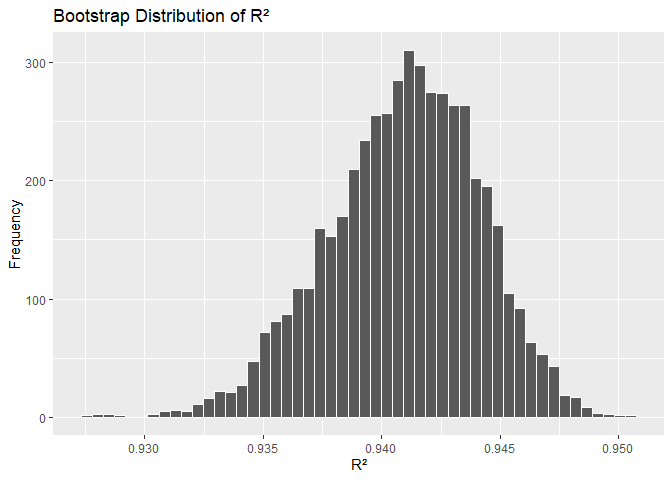
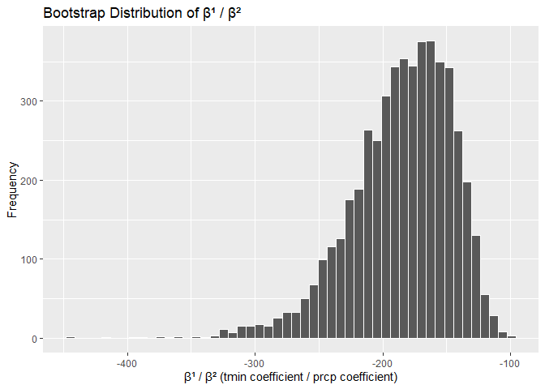
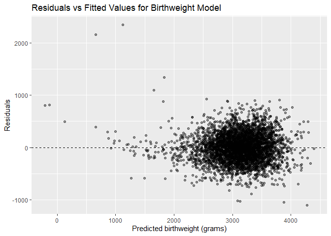
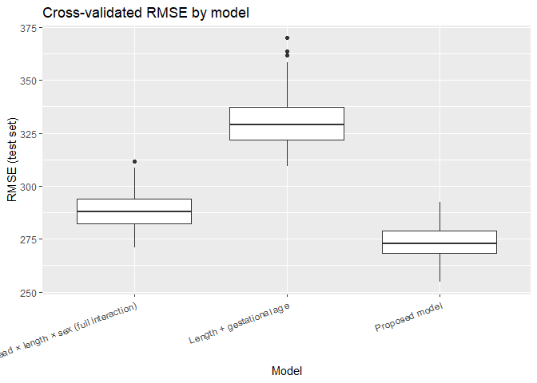

p8105_hw6_dj2764
================
Daniel Jiao (dj2764)

``` r
library(tidyverse)
library(modelr)
library(broom)
```

# Problem 1

## Load & clean the data

``` r
homicide_raw <- read_csv("data/homicide-data.csv")

homicide_df <- homicide_raw |> 
  mutate(
    city_state = str_c(city, state, sep = ", "),
    victim_race = str_to_lower(victim_race),
    victim_sex  = str_to_lower(victim_sex),
    victim_age  = as.numeric(victim_age),
    solved = if_else(disposition == "Closed by arrest", 1, 0)
  ) |> 
  # remove cities
  filter(
    !(city_state %in% c(
      "Dallas, TX", "Phoenix, AZ", "Kansas City, MO", "Tulsa, AL"
    ))
  ) |> 
  # keep white/black
  filter(victim_race %in% c("white", "black")) |> 
  drop_na(victim_age, victim_sex, victim_race)

homicide_df |> select(city_state, solved, victim_race, victim_age)
```

    ## # A tibble: 39,403 × 4
    ##    city_state      solved victim_race victim_age
    ##    <chr>            <dbl> <chr>            <dbl>
    ##  1 Albuquerque, NM      0 white               15
    ##  2 Albuquerque, NM      0 white               72
    ##  3 Albuquerque, NM      0 white               91
    ##  4 Albuquerque, NM      0 white               56
    ##  5 Albuquerque, NM      1 white               43
    ##  6 Albuquerque, NM      1 white               52
    ##  7 Albuquerque, NM      1 white               22
    ##  8 Albuquerque, NM      1 black               15
    ##  9 Albuquerque, NM      1 black               25
    ## 10 Albuquerque, NM      1 white               20
    ## # ℹ 39,393 more rows

## Baltimore, MD logistic regression

``` r
baltimore_df <- homicide_df |> 
  filter(city_state == "Baltimore, MD")

baltimore_fit <- glm(
  solved ~ victim_age + victim_sex + victim_race,
  data = baltimore_df,
  family = binomial()
)

baltimore_tidy <- broom::tidy(baltimore_fit, conf.int = TRUE, exponentiate = TRUE)

baltimore_OR_male_vs_female <- baltimore_tidy |> 
  filter(term == "victim_sexmale") |> 
  select(term, estimate, conf.low, conf.high)

baltimore_OR_male_vs_female
```

    ## # A tibble: 1 × 4
    ##   term           estimate conf.low conf.high
    ##   <chr>             <dbl>    <dbl>     <dbl>
    ## 1 victim_sexmale    0.426    0.324     0.558

## Fit logistic regressions for all cities

``` r
city_results <- homicide_df |> 
  nest(data = -city_state) |> 
  mutate(
    model = map(data, ~ glm(
      solved ~ victim_age + victim_sex + victim_race,
      data = .x,
      family = binomial()
    )),
    tidied = map(model, ~ broom::tidy(.x, conf.int = TRUE, exponentiate = TRUE))
  ) |> 
  unnest(tidied) |> 
  filter(term == "victim_sexmale") |> 
  select(city_state, estimate, conf.low, conf.high)
```

## Plot odds ratios + confidence intervals

``` r
city_results_plot <- city_results |> 
  arrange(estimate) |> 
  mutate(city_state = factor(city_state, levels = city_state))

ggplot(city_results_plot, aes(x = city_state, y = estimate)) +
  geom_point() +
  geom_errorbar(aes(ymin = conf.low, ymax = conf.high), width = 0.1) +
  geom_hline(yintercept = 1, linetype = "dashed") +
  coord_flip() +
  labs(
    title = "Adjusted OR (Male vs Female Victims) for Homicide Being Solved",
    x = "City",
    y = "Adjusted Odds Ratio (logistic regression)"
  )
```

<!-- -->

# Problem 2

## Load and prepare data

``` r
library(p8105.datasets)
data("weather_df")

weather_small <- weather_df |> 
  select(tmax, tmin, prcp) |> 
  drop_na()

fit = lm(tmax ~ tmin + prcp, data = weather_small)
```

## Run 5000 bootstrap replications

``` r
set.seed(123)

boot_results <- tibble(
  boot_id = 1:5000
) |> 
  mutate(
    sample = map(
      boot_id,
      ~ sample_n(weather_small, size = nrow(weather_small), replace = TRUE)
    ),
    
    model = map(sample, ~ lm(tmax ~ tmin + prcp, data = .x)),
    
    r2 = map_dbl(model, ~ glance(.x)$r.squared),
    
    beta_ratio = map_dbl(
      model,
      ~ {
        coefs <- tidy(.x)
        beta1 <- coefs$estimate[coefs$term == "tmin"]
        beta2 <- coefs$estimate[coefs$term == "prcp"]
        beta1 / beta2
      }
    )
  )
```

## Plot R² distribution

``` r
ggplot(boot_results, aes(x = r2)) +
  geom_histogram(bins = 50, color = "white") +
  labs(
    title = "Bootstrap Distribution of R²",
    x = "R²",
    y = "Frequency"
  )
```

<!-- -->

## Plot β¹ / β² distribution

``` r
ggplot(boot_results, aes(x = beta_ratio)) +
  geom_histogram(bins = 50, color = "white") +
  labs(
    title = "Bootstrap Distribution of β¹ / β²",
    x = "β¹ / β² (tmin coefficient / prcp coefficient)",
    y = "Frequency"
  )
```

<!-- -->

## Compute 95% confidence intervals

``` r
r2_ci <- boot_results |> 
  summarize(
    lower = quantile(r2, 0.025),
    upper = quantile(r2, 0.975)
  )

beta_ratio_ci <- boot_results |> 
  summarize(
    lower = quantile(beta_ratio, 0.025),
    upper = quantile(beta_ratio, 0.975)
  )

r2_ci
```

    ## # A tibble: 1 × 2
    ##   lower upper
    ##   <dbl> <dbl>
    ## 1 0.934 0.947

``` r
beta_ratio_ci
```

    ## # A tibble: 1 × 2
    ##   lower upper
    ##   <dbl> <dbl>
    ## 1 -277. -126.

# Problem 3

## Load and clean the data

``` r
birthweight <- read_csv("data/birthweight.csv")
```

    ## Rows: 4342 Columns: 20
    ## ── Column specification ────────────────────────────────────────────────────────
    ## Delimiter: ","
    ## dbl (20): babysex, bhead, blength, bwt, delwt, fincome, frace, gaweeks, malf...
    ## 
    ## ℹ Use `spec()` to retrieve the full column specification for this data.
    ## ℹ Specify the column types or set `show_col_types = FALSE` to quiet this message.

``` r
birthweight_df <- birthweight |>
  # make some categorical variables factors with labels
  mutate(
    babysex = factor(babysex, levels = c(1, 2),
                     labels = c("male", "female")),
    frace = factor(frace,
                   levels = c(1, 2, 3, 4, 8, 9),
                   labels = c("White", "Black", "Asian", "Puerto Rican", "Other", "Unknown")),
    mrace = factor(mrace,
                   levels = c(1, 2, 3, 4, 8),
                   labels = c("White", "Black", "Asian", "Puerto Rican", "Other")),
    malform = factor(malform, levels = c(0, 1),
                     labels = c("absent", "present"))
  ) |>
  # drop rows with any missing relevant variables (this dataset typically has no NAs, but check)
  drop_na()

# quick check for NAs (should all be zero)
birthweight_df |>
  summarise(across(everything(), \(x) sum(is.na(x))))
```

    ## # A tibble: 1 × 20
    ##   babysex bhead blength   bwt delwt fincome frace gaweeks malform menarche
    ##     <int> <int>   <int> <int> <int>   <int> <int>   <int>   <int>    <int>
    ## 1       0     0       0     0     0       0     0       0       0        0
    ## # ℹ 10 more variables: mheight <int>, momage <int>, mrace <int>, parity <int>,
    ## #   pnumlbw <int>, pnumsga <int>, ppbmi <int>, ppwt <int>, smoken <int>,
    ## #   wtgain <int>

## Propose a regression model for birthweight

``` r
bw_mod <- lm(
  bwt ~ babysex + bhead + blength + gaweeks +
    ppbmi + ppwt + wtgain + momage + mrace + smoken,
  data = birthweight_df
)

summary(bw_mod)
```

    ## 
    ## Call:
    ## lm(formula = bwt ~ babysex + bhead + blength + gaweeks + ppbmi + 
    ##     ppwt + wtgain + momage + mrace + smoken, data = birthweight_df)
    ## 
    ## Residuals:
    ##      Min       1Q   Median       3Q      Max 
    ## -1098.75  -184.03    -3.29   174.41  2339.11 
    ## 
    ## Coefficients:
    ##                     Estimate Std. Error t value Pr(>|t|)    
    ## (Intercept)       -5679.7934   102.9719 -55.159  < 2e-16 ***
    ## babysexfemale        29.1701     8.4630   3.447 0.000573 ***
    ## bhead               131.1692     3.4473  38.050  < 2e-16 ***
    ## blength              74.8096     2.0194  37.046  < 2e-16 ***
    ## gaweeks              11.3209     1.4604   7.752 1.12e-14 ***
    ## ppbmi                -9.4610     2.5729  -3.677 0.000239 ***
    ## ppwt                  3.0580     0.4124   7.414 1.46e-13 ***
    ## wtgain                4.1432     0.3940  10.515  < 2e-16 ***
    ## momage                1.1113     1.1691   0.951 0.341895    
    ## mraceBlack         -142.6671     9.7454 -14.639  < 2e-16 ***
    ## mraceAsian          -84.4743    42.6091  -1.983 0.047482 *  
    ## mracePuerto Rican  -106.1596    19.1516  -5.543 3.15e-08 ***
    ## smoken               -4.8743     0.5859  -8.319  < 2e-16 ***
    ## ---
    ## Signif. codes:  0 '***' 0.001 '**' 0.01 '*' 0.05 '.' 0.1 ' ' 1
    ## 
    ## Residual standard error: 272.6 on 4329 degrees of freedom
    ## Multiple R-squared:  0.7175, Adjusted R-squared:  0.7167 
    ## F-statistic: 916.4 on 12 and 4329 DF,  p-value: < 2.2e-16

## Residuals vs fitted plot (using add_predictions / add_residuals)

``` r
bw_aug <- birthweight_df |>
  modelr::add_predictions(bw_mod) |>
  modelr::add_residuals(bw_mod)

ggplot(bw_aug, aes(x = pred, y = resid)) +
  geom_point(alpha = 0.4) +
  geom_hline(yintercept = 0, linetype = "dashed") +
  labs(
    title = "Residuals vs Fitted Values for Birthweight Model",
    x = "Predicted birthweight (grams)",
    y = "Residuals"
  )
```

<!-- -->

## Model A: length at birth + gestational age (main effects only)

``` r
bw_mod_A <- lm(
  bwt ~ blength + gaweeks,
  data = birthweight_df
)
```

## Model B: head circumference, length, sex, and all interactions (including three-way)

``` r
bw_mod_B <- lm(
  bwt ~ bhead * blength * babysex,
  data = birthweight_df
)
```

## Cross-validated prediction error with crossv_mc

``` r
set.seed(123)

cv_df <- modelr::crossv_mc(birthweight_df, n = 100) |>
  mutate(
    train = map(train, as_tibble),
    test  = map(test, as_tibble)
  ) |>
  mutate(
    mod_main = map(train, ~ lm(
      bwt ~ babysex + bhead + blength + gaweeks +
        ppbmi + ppwt + wtgain + momage + mrace + smoken,
      data = .x
    )),
    mod_A = map(train, ~ lm(
      bwt ~ blength + gaweeks,
      data = .x
    )),
    mod_B = map(train, ~ lm(
      bwt ~ bhead * blength * babysex,
      data = .x
    ))
  ) |>
  mutate(
    rmse_main = map2_dbl(mod_main, test, ~ modelr::rmse(.x, .y)),
    rmse_A    = map2_dbl(mod_A,    test, ~ modelr::rmse(.x, .y)),
    rmse_B    = map2_dbl(mod_B,    test, ~ modelr::rmse(.x, .y))
  )
```

## summarize / plot

``` r
rmse_long <- cv_df |>
  select(rmse_main, rmse_A, rmse_B) |>
  pivot_longer(
    cols = everything(),
    names_to = "model",
    values_to = "rmse"
  ) |>
  mutate(
    model = recode(
      model,
      rmse_main = "Proposed model",
      rmse_A    = "Length + gestational age",
      rmse_B    = "Head × length × sex (full interaction)"
    )
  )

# boxplot of RMSE distributions
ggplot(rmse_long, aes(x = model, y = rmse)) +
  geom_boxplot() +
  labs(
    title = "Cross-validated RMSE by model",
    x = "Model",
    y = "RMSE (test set)"
  ) +
  theme(axis.text.x = element_text(angle = 20, hjust = 1))
```

<!-- -->

``` r
# numeric summary
rmse_long |>
  group_by(model) |>
  summarise(
    mean_rmse = mean(rmse),
    median_rmse = median(rmse)
  )
```

    ## # A tibble: 3 × 3
    ##   model                                  mean_rmse median_rmse
    ##   <chr>                                      <dbl>       <dbl>
    ## 1 Head × length × sex (full interaction)      288.        288.
    ## 2 Length + gestational age                    331.        329.
    ## 3 Proposed model                              273.        273.
